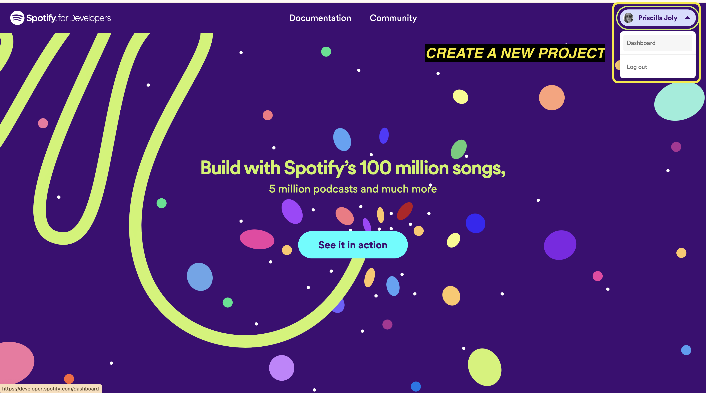
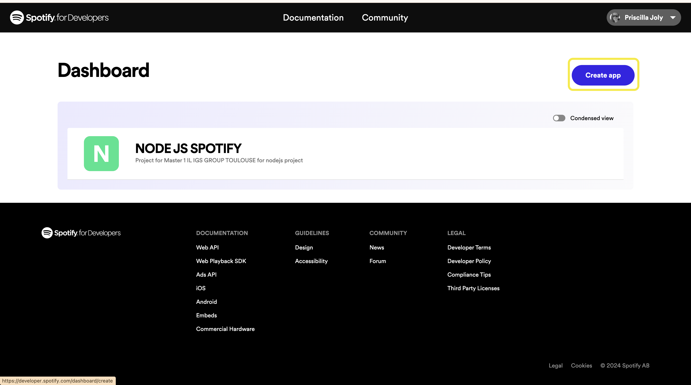
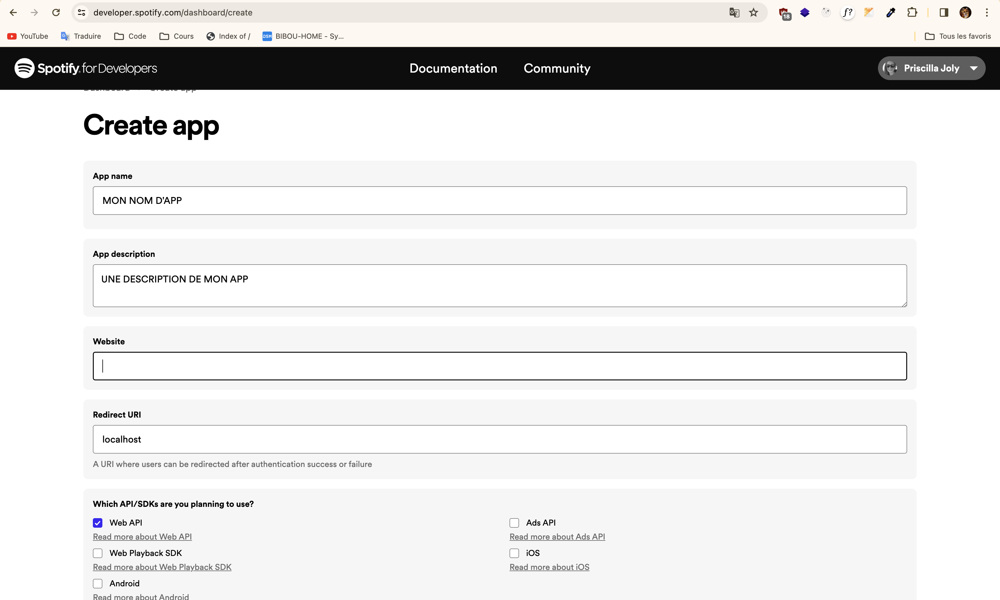
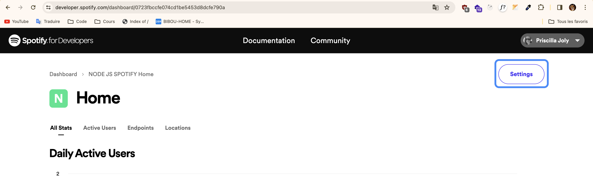
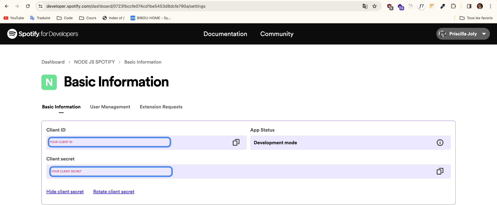
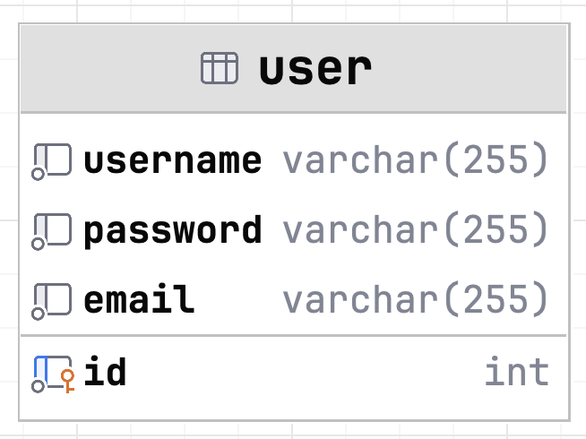

# API SPOTILIKE

Master 1 - IL

- Sharon
- Priscilla

## Spotify API

[Spotify for developer](https://developer.spotify.com/)

- Create an account or login to your account
- Follow documentation [Request an access token](https://developer.spotify.com/documentation/web-api/tutorials/getting-started#request-an-access-token)
- Create a project
- Go to your setting project and get your client secret and client id  a project, you will need into your `.env`







## Configuration

### Server
Copy / Paste `.env.example` and rename it into `.env`

Set your variables 

Create your database and use the dump script to generate your database in SQL, `server/data/db/dump.sql`

## Launch Spotilike Server

_In a new terminal_

```bash
cd server
``` 

```bash
npm i # Install packages
``` 

```bash
npm run start # Running on port 3000
```

## Launch Spotilike Client

_In a new terminal_

```bash
cd frontend/spotilike-app
``` 

```bash
npm i # Install packages
``` 

```bash
ng serve # Running on port 4200
```

## SQL diagram



## API routes

- Search _(album, artist)_
- Create account
- Spotify 
  - Generate token
- Login
- Delete Account
- Update account
- Album
  - /:id
  - /:id/tracks
- Artist
  - /:id
  - /:id/tracks