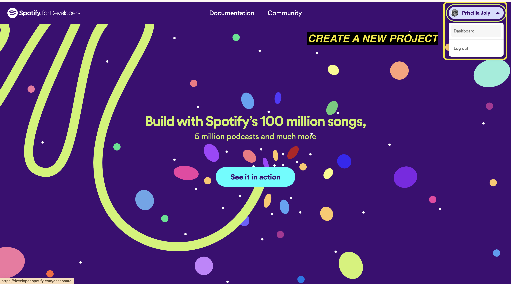
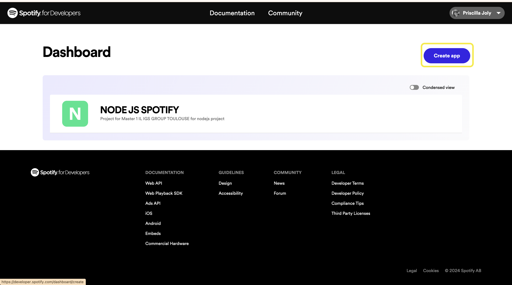

# API SPOTILIKE

Master 1 - IL

- Sharon

## Configuration

Copy / Paste `.env.example` and rename it into `.env`

## Spotify API

[]()
[Spotify for developper](https://developer.spotify.com/)


- Follow documentation [Request an access token](https://developer.spotify.com/documentation/web-api/tutorials/getting-started#request-an-access-token)
- Create an account or login to your account
- Create a project



## Launch API

```bash
npm i
```

```bash
npm run start
```